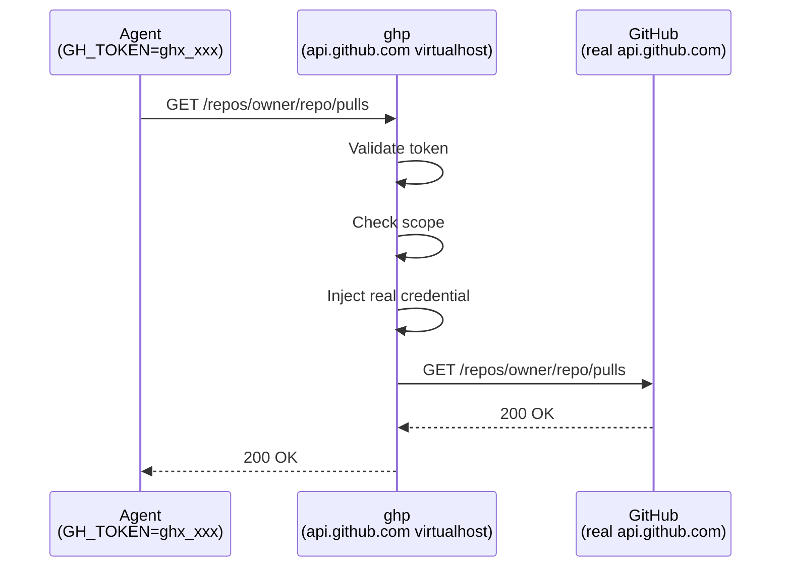

# How It Works

ghp acts as a transparent proxy for GitHub's API and web endpoints. Your
administrator configures DNS so that `api.github.com` and `github.com` resolve
to the ghp server on your network. Agents set `GH_TOKEN` to a ghp-issued token
and make standard GitHub API calls — no code changes or special SDKs required.

## Request Flow



For each request, the proxy:

1. Validates the token and checks it hasn't expired or been revoked
2. Verifies the request targets an allowed repository and permitted operation
3. Swaps in the real GitHub credentials (stored server-side, encrypted at rest)
4. Forwards the request to GitHub and returns the response unchanged

## Virtualhost Routing

ghp serves several distinct roles depending on which hostname the request arrives on:

| Hostname | Role |
|----------|------|
| `api.github.com` | **API proxy** — validates tokens, enforces scopes, injects credentials, logs every request |
| `github.com` | **Git passthrough** — transparent proxy for `git clone`, `git push`, etc. with token interception |
| `codeload.github.com` | **Codeload redirect/passthrough** — optionally redirects repo archive downloads to a caching mirror (see [Codeload Redirect](features/codeload.md)); transparent passthrough otherwise |
| `*.githubcopilot.com` | **Copilot passthrough** — forwards Copilot traffic transparently; all requests are logged |
| Your management host | **Dashboard** — web UI, GitHub OAuth login (web), CLI device-authorization endpoints, token management API |

In TLS mode (recommended for production), ghp terminates TLS directly and uses
SNI to select the correct certificate for each hostname. In plain HTTP mode
(for development or behind a reverse proxy), routing is based on the `Host`
header alone.

## High Availability

ghp can run as multiple instances behind a load balancer. All transient auth
state — browser sessions, in-flight OAuth state tokens for the GitHub login
redirect, OAuth broker state, and CLI device-authorization records — is
stored in the configured database (PostgreSQL, SQLite, or Vault), not in
process memory. A user signed in on instance A can be served their next
request from instance B, the GitHub OAuth callback for a redirect launched
on instance A is valid against instance B, and a CLI device flow whose
`/cli/auth/device` and `/cli/auth/device/token` calls land on different
instances completes correctly.

A background cleanup goroutine on each instance periodically purges expired
sessions, OAuth state rows, and device-auth records (default every 5
minutes). For the SQLite backend this is in-process; for PostgreSQL and
Vault it is shared by all instances and idempotent.

## Security Model

- **Token isolation** — agents never see real GitHub credentials; they only hold short-lived ghp tokens
- **Scope enforcement** — tokens can be restricted to specific repositories and permission levels
- **Encryption at rest** — for SQLite and PostgreSQL backends, all stored GitHub credentials are encrypted with AES-256-GCM using a server-managed key. For the Vault backend, Vault provides encryption at rest natively, so no application-level encryption key is required
- **Audit trail** — all requests produce OpenTelemetry access log records (method, path, status, duration) described using HTTP semantic conventions. API proxy requests additionally produce audit log records under the `github.com/goodtune/ghp/audit` instrumentation scope that include token, user, session, repository details, and request context. Token lifecycle events (creation, revocation, scope updates) also emit audit records but may omit repository and request-related fields. All records are written to the same console stream (and, when configured, exported to an OTLP collector). Capturing and indexing these logs is the responsibility of the deployment environment (e.g. Splunk, Elastic, Datadog). See [Monitoring → Logging](admin/monitoring.md#logging) for the full attribute reference
- **Expiration** — tokens have a configurable lifetime (default 24 hours, up to a server-configured maximum; default maximum 7 days). Operators can enable `tokens.allow_no_expiry` to permit creating tokens that never expire (`"duration": "never"` in the API). Non-expiring tokens are useful for long-lived automation managed via infrastructure-as-code (e.g. Terraform) where token lifecycle is controlled externally through revocation rather than time-based expiry
- **Revocation** — tokens can be revoked immediately from the CLI or web dashboard
- **Hard deletion** — expired and revoked token records are periodically removed from the database after a configurable retention period (default 30 days, controlled by `tokens.expired_token_retention_period`). This prevents unbounded growth of the token table and ensures that token hashes are physically erased after the retention window, limiting the exposure surface if the database is compromised. Tokens with no expiry are only hard-deleted once they have been revoked and the retention period has elapsed
- **Border policy** — administrators can block specific GitHub token types from passing through the proxy (see [Token Type Border Policy](features/border-policy.md))
- **Enterprise access restriction** — when `github.enterprise_slug` is set, ghp injects GitHub Enterprise Cloud's `sec-GitHub-allowed-enterprise` header so GitHub rejects requests from accounts outside the enterprise. Specific external owners or repositories can be exempted via `github.enterprise_exceptions`, optionally gated on org team membership and optionally substituting a managed GitHub App identity for the caller's credential. Configuring a valid exception also permits the API-root token-scope check and the identity-only GraphQL `viewer { login }` query used by `gh auth login`, allowing external accounts to complete login while other requests remain subject to the restriction (see [Enterprise Restriction](admin/github-app.md#enterprise-restriction)).

## Feature Summary

### Token Scoping

Tokens can be scoped to specific repositories and permission levels, ensuring
agents only access what they need. Open-scoped tokens (no restrictions) are
also supported when full access is appropriate.

See [Token Scoping](features/token-scoping.md) for details.

### Blocking Anonymous Git Traffic

Administrators can block unauthenticated git operations (clone, fetch,
ls-remote) from passing through the proxy. When enabled, requests without
credentials are rejected immediately rather than being forwarded to GitHub.

```yaml
block:
  anonymous_git: true
```

This setting can be changed without restarting the server (see
[Configuration](admin/configuration.md#hot-reloading)).

!!! note "Requires Git protocol version 2"
    Anonymous git blocking relies on the `Git-Protocol` header that Git 2.26+
    sends by default. Older Git clients that use protocol v0 or v1 are not
    detected and will pass through unblocked.

### Release Download Controls

GitHub release assets (binaries, installers, archives) are fetched via direct
HTTPS downloads, outside the scope model that ghp applies to API traffic. The
release controls feature lets administrators block or redirect these downloads.

See [Release Download Controls](features/release-controls.md) for configuration
and details.

### Copilot Passthrough

Traffic to `*.githubcopilot.com` is forwarded transparently. Copilot clients
manage their own credentials, so ghp does not intercept tokens or enforce
scopes on this traffic. All Copilot requests are still logged and counted
in metrics for full visibility.

### Git Cache

For frequently-cloned repositories, ghp can cache git objects locally and serve
subsequent clone/fetch requests from cache. This reduces load on GitHub and
improves clone performance. Caching is opt-in per repository and always
verifies GitHub access before serving cached data.

See [Git Cache](features/git-cache.md) for configuration and details.

### Multi-App Support

ghp supports multiple GitHub Apps simultaneously. Each app can have its own
set of installations, and agent tokens (`gha_`) can be scoped to a specific
app. This is useful for organizations that need to separate concerns across
different GitHub Apps (e.g., CI vs. code review vs. deployment).

Apps are managed dynamically via the admin UI or API (`/api/apps`). Changes
take effect immediately — no restart or config reload is needed.

On first startup, if no apps exist in the database, the config-based GitHub App
(`github.app_id`, `github.private_key`, etc.) is automatically seeded as a
default App record in the store. Any existing agent tokens that have no app
association are backfilled to point to the newly created default app. After
seeding, all app management goes through the store — the config-based values
are not used as an independent provider in parallel with store apps.

If apps exist in the store but none can be loaded (e.g. all private keys are
invalid), agent token creation returns HTTP 503 rather than creating tokens
that would fail at use-time.

### Storage Backends

ghp supports three storage backends:

- **SQLite** — single-file database, ideal for development and small deployments
- **PostgreSQL** — production-grade relational database
- **HashiCorp Vault** — secrets-native storage using KV v2 secrets engine, authenticating via AppRole or Kubernetes service-account auth

All backends implement the same `Store` interface and provide identical
feature parity. The Vault backend stores all data (users, tokens, apps) as
KV v2 secrets and uses index entries for lookups. It does not require SQL
migrations and does not need an `encryption_key` (Vault encrypts at rest).

When ghp runs on Kubernetes, the Vault backend can authenticate using the
pod's projected service account JWT directly — no AppRole role-id /
secret-id provisioning is needed and Vault Secret Operator (VSO) is not
required for the auth path. ghp re-reads the projected token from disk on
every re-authentication, so kubelet-rotated tokens are picked up
automatically.

!!! note "Vault concurrency limitation"
    Vault KV does not support atomic increments. Token usage counters use a
    read-modify-write pattern protected by an in-process mutex. In
    multi-instance deployments sharing the same Vault backend, concurrent
    usage counter updates may be lost. The counters are best-effort in this
    configuration.

See [Configuration](admin/configuration.md) for backend-specific settings and
[Vault Backend](admin/vault.md) for a complete Vault setup guide.

### OAuth Broker

ghp can act as an OAuth broker for other services on your network, allowing
them to authenticate users via GitHub without needing their own OAuth
credentials.

See [OAuth Broker](features/oauth-broker.md) for integration details.
